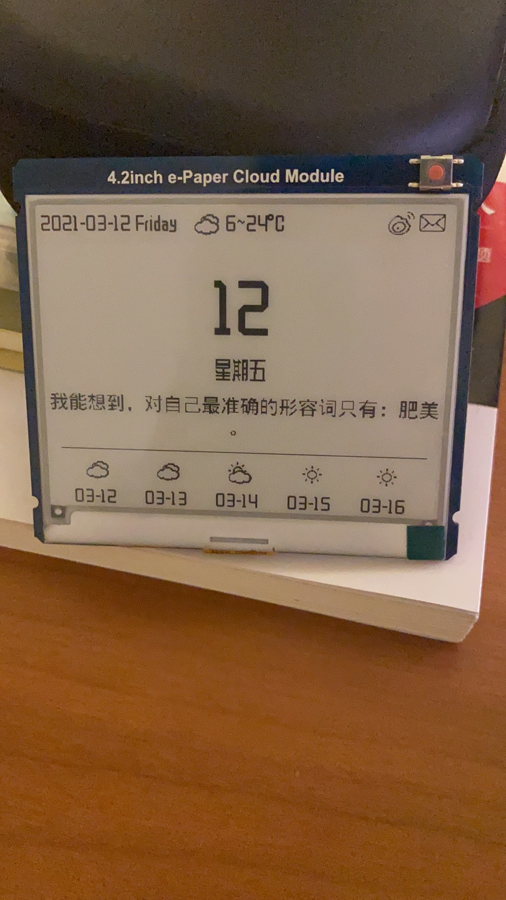

# 4.2inch e-Paper Cloud Module 墨水屏开发Demo

日历+毒鸡汤+天气预报

## 运行环境

- 硬件环境：[4.2inch e-Paper Cloud Module](https://www.waveshare.net/wiki/4.2inch_e-Paper_Cloud_Module)
- 运行环境：Python3+pip3
- 开发环境：macOS Bigsur v11+

代码是在macOS上测试的，理论上其他平台也能跑，依赖模块见requirements.txt，通过pip安装依赖:

`python3 -m pip install -r requirements.txt`

## 数据API

代码中用到了：[彩云天气API](https://open.caiyunapp.com/%E5%BD%A9%E4%BA%91%E5%A4%A9%E6%B0%94_API_%E4%B8%80%E8%A7%88%E8%A1%A8)，[高德API](https://developer.amap.com/)和Alone88提供的[毒鸡汤api](https://v1.alapi.cn/api/soul)

项目中用到的API Key均从网上搜索得来，仅做学习用途，请勿商用，谢谢配合。

## 运行效果

使用本项目代码的前提是假设你已经了解如何配置微雪的4.2inch e-Paper Cloud Module，配置好硬件后，在上位机运行如下代码：

```python
python3 epdserv.py
```

## Docker容器部署

如果你打算采用docker容器的方式部署，可以使用以下命令运行容器

```bash
docker pull hiwanz/waveshare-epaper-cloud
docker run -d -it -p 6868:6868 --name myepaperdemo hiwanz/waveshare-epaper-cloud
```

唤醒模块后运行效果如下：


